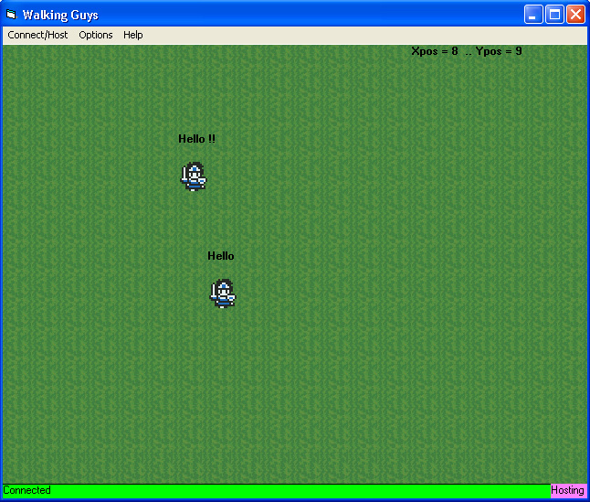



## \[Winsock Simple Multiplayer Game\]

### Description

This is a heavily commented demonstration of how to connect two people through the winsock to create a simple game. This includes Get External IP feature and copy it to cplipboard fast, Skins, Say feature to communicate, anything to get you started with Winsock Multiplayer Games programming. Enjoy & Vote :p
 
### More Info
 

             |
---                |---
**Submitted On**   |2003-12-24 13:39:22
**By**             |[Mephisto](https://github.com/Planet-Source-Code/PSCIndex/blob/master/ByAuthor/mephisto.md)
**Level**          |Advanced
**User Rating**    |5.0 (85 globes from 17 users)
**Compatibility**  |VB 6\.0
**Category**       |[Internet/ HTML](https://github.com/Planet-Source-Code/PSCIndex/blob/master/ByCategory/internet-html__1-34.md)
**World**          |[Visual Basic](https://github.com/Planet-Source-Code/PSCIndex/blob/master/ByWorld/visual-basic.md)
**Archive File**   |[\[Winsock\_S16866012242003\.zip](https://github.com/Planet-Source-Code/mephisto-winsock-simple-multiplayer-game__1-50597/archive/master.zip)

